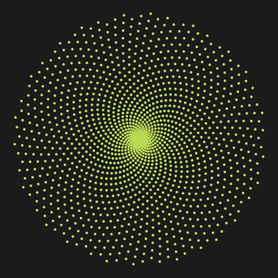

# Sunflower

A fun little interactive tool for playing with Fibonacci Distribution in a
Circle.

Can produce patterns like the following, and more! [Try it out now!](https://sunflower.xn--sberg-lra.net/)

Inspired by Sebastian Lague's video about boids  
